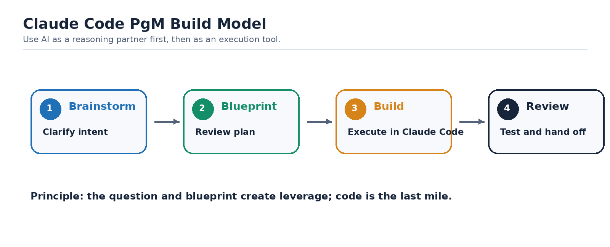
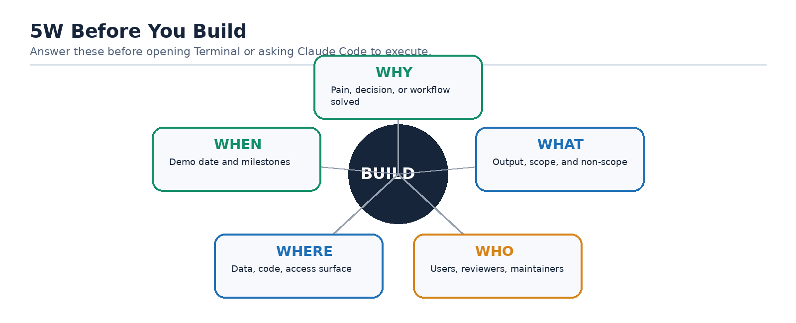
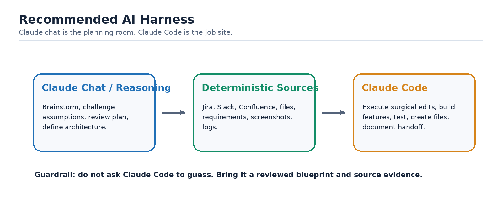
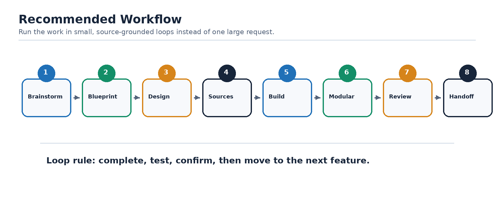
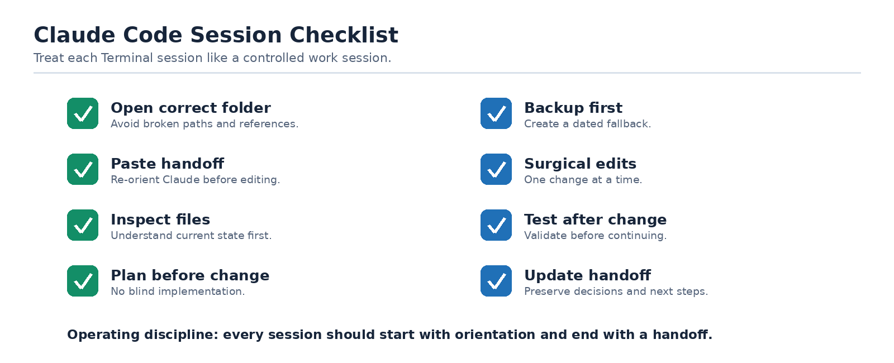
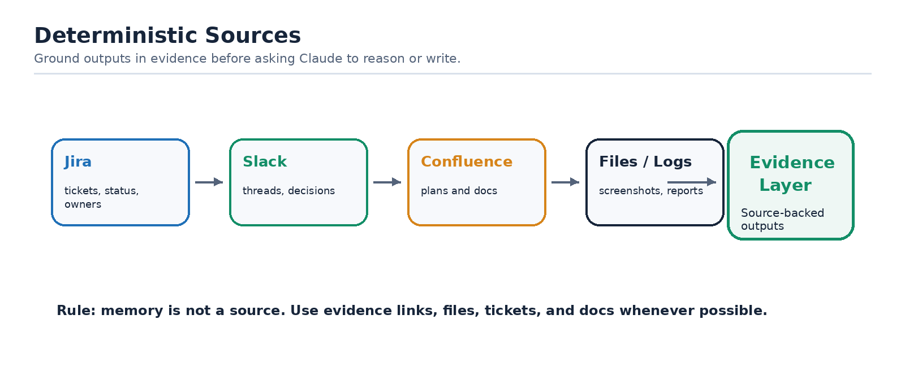
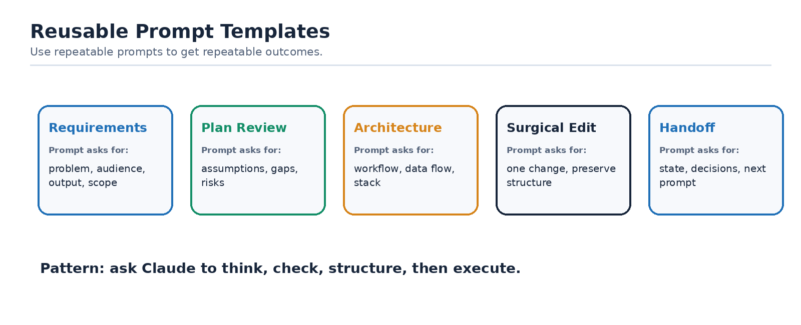
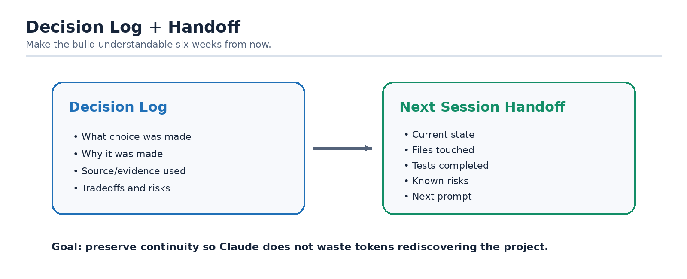
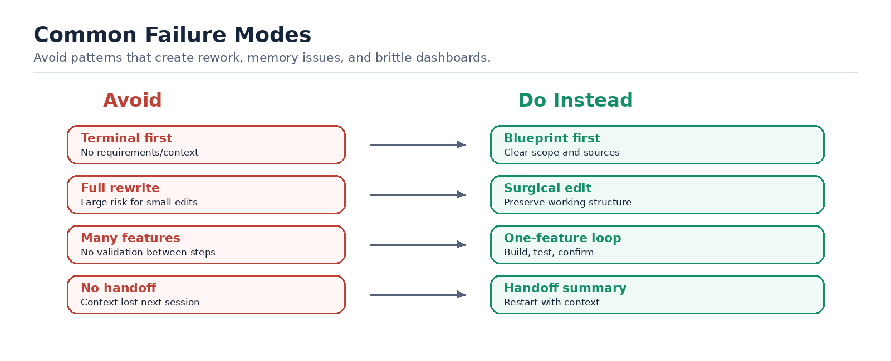

# Claude Code Best Practices for PgMs

_Building AI dashboards, reports, and workflow tools with structure, evidence, and human review_

*Figure 1. Brainstorm first, then blueprint, build, and review.*

::: callout gold
**Golden Rule**

Brainstorm before you command. Use Claude to clarify the why, evidence, assumptions, architecture, and workflow before asking it to build. A little structure upfront prevents token waste, broken files, and confusing rebuilds later.
:::

## Purpose

This guide gives CrowdStrike PgMs a practical workflow for using Claude Code and Claude chat to build dashboards, reports, and lightweight workflow tools. It combines the original vibe-coding guidance with added PgM-specific recommendations: deterministic source grounding, 5W framing, plan review, architecture review, and session handoff discipline.

## 5W Before You Build

*Figure 2. The 5W frame turns vague intent into build-ready context.*

Before opening Terminal or asking Claude Code to build, answer these questions yourself or iterate with Claude in chat. Use this order:

- **Why:** Why are we building this? What pain, decision, or workflow does it solve?
- **What:** What should the dashboard/report/tool actually do? What is in scope and out of scope?
- **Who:** Who will use it, review it, maintain it, and approve outputs?
- **Where:** Where will the data come from, where will the code live, and where will users access it?
- **When:** When is it needed, what is the demo date, and what are the incremental milestones?

::: callout green
**PgM Mindset**

The PgM is not just a prompt sender. The PgM is the prompter, product owner, and requirements translator. Your job is to give Claude the deterministic sources, the operating context, the constraints, and the success criteria so it can help you build the right thing.
:::

## Recommended AI Harness

*Figure 3. Use Claude chat for reasoning and Claude Code for controlled execution.*

- Default to Claude for this workflow when possible, especially Claude Code plus Claude chat/reasoning for blueprinting and plan review.
- Use Gemini only when it is the approved workplace option or when access constraints require it; expect to provide stronger structure and more explicit review prompts.
- Use the chatbot for brainstorming, plan review, assumption checking, and architecture thinking before using Claude Code for file-level implementation.
- Use Claude Code for execution in a project folder after the requirements, architecture, and next steps are clear.

## Recommended Workflow

*Figure 4. Build through small validated loops, not one large request.*

1. **Brainstorm first:** Start in Claude chat or your approved GenAI tool. Describe the problem, user, decision, output, and source systems. Ask Claude to turn the idea into functional requirements.
2. **Validate the blueprint:** Ask Claude to review the plan for logical fallacies, wrong assumptions, missing dependencies, unclear scope, and risky shortcuts before building.
3. **Ask for workflow, architecture, and stack options:** Before coding, ask Claude to propose the workflow, file structure, architecture, data flow, and tech stack changes. Do not let it jump straight to implementation.
4. **Ground the build in deterministic sources:** Use real sources wherever possible: Jira queries, Confluence pages, Slack thread links, CSV exports, API responses, and approved requirements. Do not rely on memory or vibes for source-of-truth behavior.
5. **Build one feature at a time:** Treat each feature or report section as its own mini-project. Complete, test, and commit or back up before moving on.
6. **Keep it modular:** Ask Claude to preserve modular sections/files so one change does not require rewriting the whole dashboard or report.
7. **Review regularly:** Stop periodically and ask Claude: What could break as this grows? What assumptions are risky? What should be refactored before adding more?
8. **End with a handoff summary:** Close every session with a summary of what changed, decisions made, files touched, known risks, and next steps. Paste this into the next session.

## Best Practices

Use the following visuals as operating cues: define the 5W, ground the work in deterministic sources, keep Claude Code changes surgical, and close every session with a reusable handoff.

| Practice | Why It Matters | Prompt / Action |
| --- | --- | --- |
| Define requirements before building | Prevents Claude from guessing and reduces rework. | "Turn this idea into functional requirements, assumptions, risks, and acceptance criteria." |
| Ask for plan review | Catches weak logic before code exists. | "Review this blueprint for logical fallacies, wrong assumptions, gaps, and better alternatives." |
| Use deterministic sources | Keeps reports factual and reproducible. | Attach/export Jira, Slack, Confluence, CSVs, or API outputs and tell Claude which source is authoritative. |
| Ask for architecture first | Prevents one giant fragile file. | "Propose the workflow, architecture, folder structure, and tech stack before coding." |
| One feature at a time | Avoids memory blowups and hard-to-debug changes. | "Implement only this section; do not rewrite unrelated files." |
| Save dated versions | Provides rollback when Terminal changes break something. | "Before changing this, create a dated backup copy." |
| Make surgical edits | Keeps context small and avoids full-file rewrites. | "Make only this change without rewriting the whole file." |
| Maintain decision log | Preserves why choices were made. | "Append this decision to DECISIONS.md with date, reason, and tradeoff." |
| End with handoff summary | Allows clean restart next session. | "Summarize current state, files changed, decisions, open risks, and next prompt." |

## Claude Code Session Checklist

*Figure 5. Start with orientation and end with a handoff.*

- Open the correct project folder in Terminal before starting Claude Code.
- Paste the last handoff summary and ask Claude to confirm the current state.
- Ask Claude to inspect the relevant files before editing.
- Ask for a short implementation plan before changes begin.
- Create a dated backup before major changes.
- Make one change at a time and test after each change.
- Do not allow full-file rewrites for small edits.
- Ask Claude to update the decision log and handoff summary before ending.

## Deterministic Sources: What Should Be Grounded

*Figure 6. Deterministic sources form the evidence layer for trustworthy outputs.*

For PgM workflows, deterministic sources are the inputs Claude should treat as source-of-truth. The agent can reason across them, but it should not invent facts that are not present in the source material.

| Source | Use It For | Guardrail |
| --- | --- | --- |
| Jira | Scope, status, ownership, blockers, sprint movement, aging items. | Confirm filters, dates, and boards before using counts. |
| Confluence | Operating model, decisions, roadmap, requirements, weekly updates. | Use the latest page version and cite page/source when possible. |
| Slack | Coordination signals, decisions, blockers, follow-ups, escalation context. | Summarize threads; do not treat casual speculation as fact. |
| CSV/API exports | Metrics, counts, report data, deterministic dashboards. | Validate schema, timestamps, and refresh timing. |
| Meeting notes/transcripts | Decisions, action items, open questions, owners. | Separate stated decisions from inferred next steps. |

## Reusable Prompt Templates

*Figure 7. Templates make good prompting repeatable across PgMs.*

**Requirements:**

> I am building [dashboard/report/tool] for [audience]. The problem is [problem]. The output should help users [decision/action]. Turn this into functional requirements, assumptions, risks, out-of-scope items, and acceptance criteria.

**Plan Review:**

> Review this plan/blueprint before implementation. Identify logical fallacies, wrong assumptions, missing dependencies, unclear requirements, data risks, and simpler alternatives. Return recommended changes before coding.

**Architecture:**

> Propose the workflow architecture, data flow, folder structure, file ownership, and tech stack. Keep it modular and easy to maintain. Call out what should be deterministic vs generated.

**Surgical Edit:**

> Make only this specific change: [change]. Do not rewrite the whole file. Preserve existing layout, naming, and working behavior. Explain exactly which files changed.

**Handoff:**

> Create a handoff summary with: current state, files changed, decisions made, assumptions, unresolved issues, testing completed, and the next recommended prompt.

## Decision Log Template

*Figure 8. Decision logs and handoffs preserve project memory.*

| Date | Decision | Why | Tradeoff / Risk | Owner |
| --- | --- | --- | --- | --- |
|  |  |  |  |  |
|  |  |  |  |  |
|  |  |  |  |  |

## End-of-Session Handoff Template

- What was built or changed:
- Files touched:
- Decisions made:
- Known risks or bugs:
- Tests completed:
- What should happen next:
- Suggested next prompt:

## Common Failure Modes to Avoid

*Figure 9. Common failure patterns and their safer alternatives.*

- Starting in Terminal before defining the requirements.
- Letting Claude rewrite an entire file to make one small change.
- Asking for multiple features at once without validating each step.
- Moving project folders after paths and references have been created.
- Using vague memory instead of deterministic source material.
- Skipping architecture review and ending up with a monolithic dashboard.
- Ending a session without a handoff summary.
