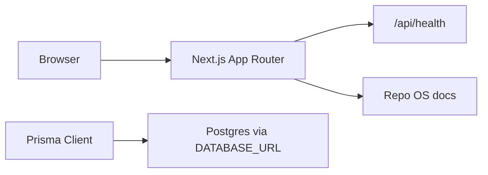
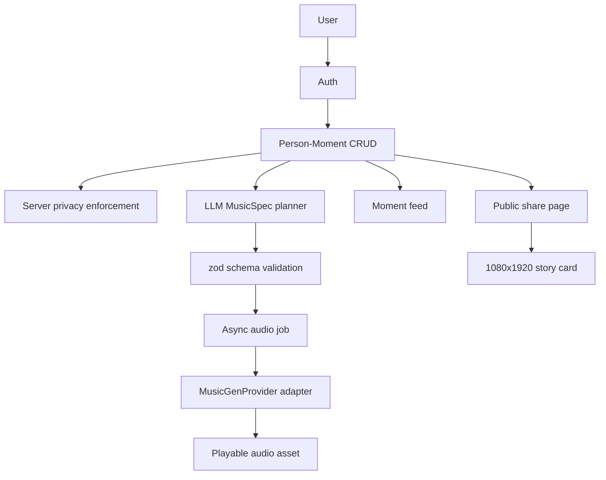

# Architecture

## Boundaries

- `src/app`: Next.js App Router pages and route handlers.
- `src/lib/db`: Prisma client and database boundary.
- `src/lib/foundation`: Gate 0 product constants used by the shell and tests.
- `prisma`: Prisma schema and migrations.
- `docs`: Operating-system docs updated each gate.
- `test`: Vitest checks for repo invariants and unit behavior.

## Current Gate 0 Flow

## Target Core Flow By Gate E

## Data Flow Rules

- Raw journal text is stored only on private user-owned moment records.
- Public surfaces read from safe summaries, not raw moment input.
- Music generation receives MusicSpec JSON, not raw private journal text.
- Audio provider implementations sit behind an adapter.
